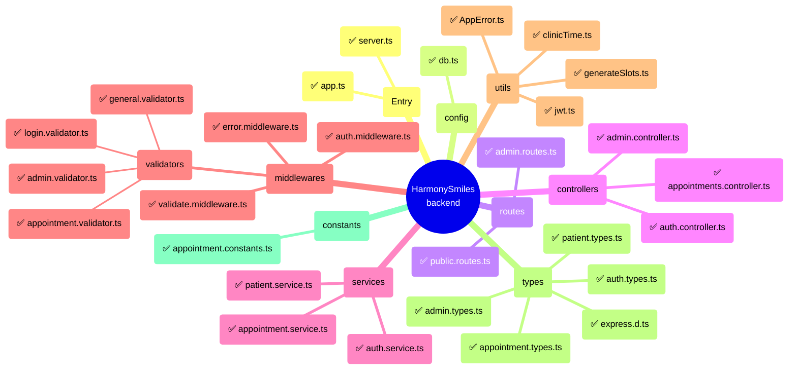
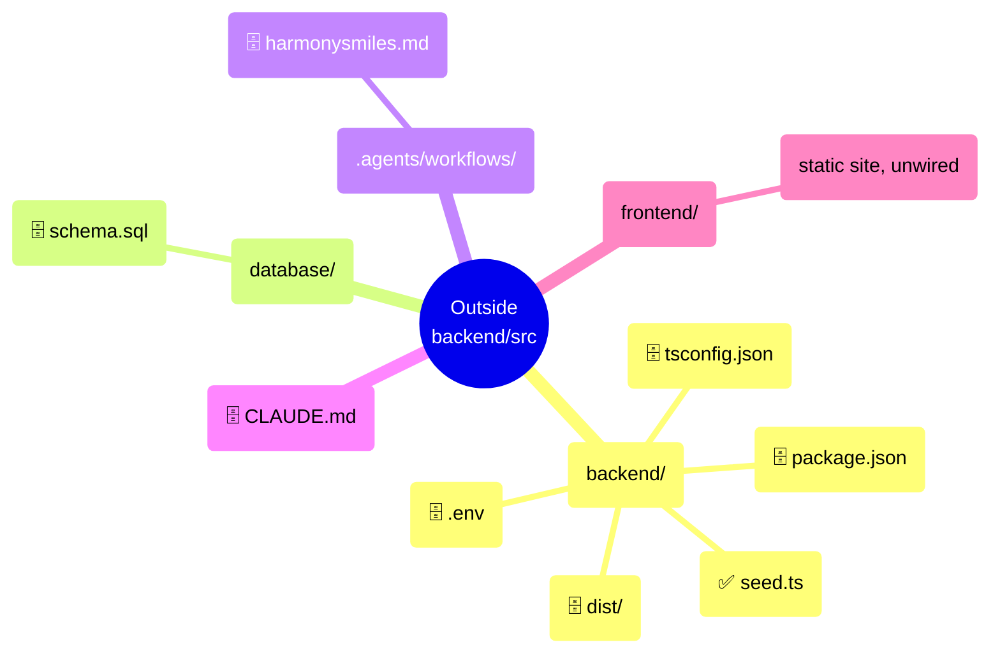

# HarmonySmiles — File-by-File Mind Map

This document maps every file in `backend/src/`, plus the files outside it that carry real weight, explaining: **what it's for**, **how it's meant to work**, and **what breaks if it's missing/empty forever**.

Legend: ✅ implemented and wired up · ⬜ empty stub (planned, not built) · 🗄️ config/data, not source code

---

## Mind map

---

## `backend/src/` — entry points

### `server.ts` ✅
**Purpose:** the actual process entry point — the file `npm run dev` / `npm start` executes.
**How it works:** loads `.env` via `import 'dotenv/config'` (must happen before anything reads `process.env`), imports the configured `app` from `./app.js`, reads `PORT` (default `3000`), calls `app.listen`.
**If missing:** there is nothing to run. `app.ts` could still be imported by tests, but there is no way to actually start the HTTP server — `npm run dev`/`npm start` would fail immediately.

### `app.ts` ✅
**Purpose:** builds and exports the configured Express app — middleware registration, route mounting, central error handler. Deliberately does **not** call `.listen()`, so it can be imported in isolation (e.g. by a future test suite with `supertest`) without binding a port.
**How it works:** `express()` → `express.json()` body parser → mounts `publicRouter` at `/api` → mounts `errorMiddleware` **last** (Express only recognizes 4-argument middleware as an error handler, and it only catches errors from routes registered *before* it).
**If missing:** no Express app exists at all. `server.ts` has nothing to import; every route/controller/middleware in the project becomes unreachable even though each file compiles fine on its own. (This was actually broken earlier in this project's history — `app.ts` was empty and the app setup had accidentally been written into `server.ts` instead.)

---

## `backend/src/config/`

### `db.ts` ✅
**Purpose:** the single source of truth for talking to Postgres — nothing else in the project is allowed to create its own connection or pool.
**How it works:** builds a `pg.Pool` from `DB_*` env vars; exports four things:
- `query<T>()` — auto checkout/release, fine for one-off single statements; generic to match `client.query<T>()`'s ergonomics.
- `getClient()` — manual checkout; caller must `.release()` themselves. Needed when multiple statements must share one connection.
- `withTransaction(fn)` — wraps `fn` in `BEGIN` → `fn(client)` → `COMMIT`, rolling back and releasing the client on any thrown error. This is what every atomic multi-step write should use.
- `closePool()` — ends the pool; only `seed.ts` calls this, so a one-off script actually exits instead of hanging on an open connection. The long-running server never calls it.
**If missing:** nothing could reach the database. Every service that touches Postgres (today: `appointment.service.ts`; later: auth, admin, slots) would have to reimplement pool creation and connection handling itself — almost guaranteed to be done inconsistently, with some code paths leaking connections by forgetting `.release()`.

---

## `backend/src/routes/`

### `public.routes.ts` ✅
**Purpose:** declares the unauthenticated, patient-facing endpoints — `POST /appointments` and `GET /available-slots`.
**How it works:** an Express `Router`, mounted at `/api` in `app.ts`, wiring `validate(createAppointmentSchema)` in front of `createAppointment` and `validate(availableSlotsSchema)` in front of `getAvailableSlots`.
**If missing:** `app.ts` has nothing to mount at `/api` — every public-facing feature becomes unreachable over HTTP despite every underlying file being correct. This is literally the bug found and fixed earlier in this project: the route existed logically but was never mounted, so `POST /appointments` could not actually be called.

### `admin.routes.ts` ✅
**Purpose:** declares the `/admin/*` endpoints — `login`, plus list/view/confirm/cancel/delete appointments and list patients.
**How it works:** `POST /login` is registered **first** (public, validated by `loginSchema`), then `adminRouter.use(authMiddleware)` is called — every route added *after* that line automatically requires a valid admin token, without needing its own protection check. `GET /appointments` (`validate(listAppointmentsSchema)`), `GET /appointments/:id`, `PATCH /appointments/:id/confirm`, `PATCH /appointments/:id/cancel`, `DELETE /appointments/:id` (all four sharing `validate(appointmentIdParamSchema)`), and `GET /patients` (`validate(listPatientsSchema)`) are registered after that line, so they're protected by construction. This ordering, not a per-route exception list, is the actual protection mechanism.
**If missing:** no admin controller can be reached over HTTP no matter how complete its implementation is — routes are the only thing binding a URL+method to a controller function.

---

## `backend/src/controllers/`

### `appointments.controller.ts` ✅
**Purpose:** the thin HTTP-layer glue for "create appointment" and "list available slots" — translates an already-validated request into a service call and a JSON response.
**How it works:** `createAppointment` reads `req.body` (already validated *and coerced* by `validate` middleware upstream), calls `createAppointmentService`, responds `201` with the created row. `getAvailableSlots` reads `req.query.date` (already validated), calls `getAvailableSlotsService`, responds `200` with the slot list. Both forward any thrown error to `next(error)`.
**If missing:** `POST /api/appointments` and `GET /api/available-slots` have no handlers to wire into `public.routes.ts` — patients have no way to book, or to see what's bookable, via the API.

### `admin.controller.ts` ✅
**Purpose:** the admin dashboard's entire backend surface — list all appointments (optionally filtered), get one by id, confirm/cancel/delete, and list all patients (optionally filtered).
**How it works:** `listAppointments`/`listPatients` read validated/coerced `req.query.{status,search}`/`req.query.search` and call `listAppointmentsService`/`listPatientsService`; the other four read validated/coerced `req.params.id` (a `number`, though Express's own types still say `string` — hence the `as unknown as { id: number }` cast, same reasoning as `req.query` casts elsewhere) and call the matching service function. All six just format the result as JSON or forward errors to `next(error)`.
**If missing:** clinic staff would have no way to see or act on incoming bookings, or see who their patients even are, except querying Postgres by hand.

### `auth.controller.ts` ✅
**Purpose:** handler for `POST /admin/login` — delegates credential checking to `auth.service.ts`, returns `{ success, message, token, admin }`.
**How it works:** thin wrapper matching `appointments.controller.ts`'s shape — calls `loginService(req.body)`, responds `200`, or `next(error)` on failure (wrong credentials become a `401` via `AppError`, handled centrally by `error.middleware.ts`).
**If missing:** there is no login endpoint at all, which means `auth.middleware.ts` has nothing to gate access *behind* — admin functionality would either be unreachable or would have to ship unauthenticated, defeating the entire purpose of having a JWT middleware.

---

## `backend/src/services/`

### `appointment.service.ts` ✅
**Purpose:** owns every piece of business logic touching the `appointments` table — the transactional booking flow, available-slot computation, and (now) the admin CRUD surface: `createAppointmentService`, `getAvailableSlotsService`, `listAppointmentsService`, `getAppointmentByIdService`, `confirmAppointmentService`, `cancelAppointmentService`, `deleteAppointmentService`.
**How it works:** `createAppointmentService`, inside `withTransaction`, does an atomic `INSERT ... ON CONFLICT (phone) DO NOTHING RETURNING id` against `patients` (falling back to a `SELECT` by phone only on conflict, so concurrent signups for a brand-new phone number can't create duplicate patients), then inserts the appointment. Outside the transaction, it catches a Postgres `DatabaseError` on the `unique_active_appointment` constraint and rethrows it as an `AppError(409)` with a friendly message. `getAvailableSlotsService` runs a plain (non-transactional) `SELECT appointment_time FROM appointments WHERE appointment_date = $1 AND status IN ('Pending', 'Confirmed')`, then hands the booked times to the pure `utils/generateSlots.ts::generateAvailableSlots`. The admin functions are all plain (non-transactional) single-statement queries: `listAppointmentsService` builds a dynamic `WHERE` clause only for filters actually supplied (`status` exact match, `search` as an `ILIKE` across the joined patient's first/last name and phone) and always `ORDER BY appointment_date, appointment_time`; `getAppointmentByIdService`/`confirmAppointmentService`/`cancelAppointmentService`/`deleteAppointmentService` all throw `AppError('Appointment not found', 404)` when the target row doesn't exist, via a shared internal `updateAppointmentStatusService(id, status)` for the confirm/cancel pair.
**If missing:** `appointments.controller.ts`/`admin.controller.ts` have nothing to call. There is no other file implementing this logic — booking, slot-listing, and the entire admin dashboard would be entirely broken, and the database's core anti-double-booking design (the partial unique index) would have no code path ever hitting it.

### `patient.service.ts` ✅
**Purpose:** owns queries over the `patients` table on its own (not joined with `appointments`) — currently just `listPatientsService`, backing the admin dashboard's patients table.
**How it works:** a plain (non-transactional) `SELECT` directly against `patients`, with the same dynamic-`WHERE`/optional-`search` pattern as `appointment.service.ts::listAppointmentsService` (`ILIKE` across first/last name, phone, and MRN), ordered by `last_name, first_name`.
**If missing:** `admin.controller.ts::listPatients` has nothing to call — the admin dashboard would have no way to see the patient roster independent of their appointments.

### `auth.service.ts` ✅
**Purpose:** looks up an admin row by username, compares the bcrypt hash of the submitted password, and on success signs a JWT via `utils/jwt.ts`.
**How it works:** `SELECT ... FROM admins WHERE username = $1`; if no row **or** the `bcrypt.compare` fails, throws the exact same `AppError('Invalid username or password', 401)` in both cases — deliberately not distinguishing "no such user" from "wrong password" in the response, so a caller can't use the login endpoint to enumerate valid usernames. On success, signs `{ adminId, username }` via `signToken` and returns the admin's public fields (never the `password_hash`).
**If missing:** `auth.controller.ts` has no logic to call — login cannot function even with the controller/route/validator fully wired.

---

## `backend/src/middlewares/`

### `error.middleware.ts` ✅
**Purpose:** the *only* place in the codebase that decides HTTP status codes for thrown errors — this is what keeps every controller as thin as `next(error)`.
**How it works:** a 4-argument Express error handler, mounted last in `app.ts`. Branches: `ZodError` → `400` + per-field messages; `AppError` → its own `statusCode`; anything else → `500` (and logs the real error server-side via `console.error`, since a generic 500 should never leak internals to the client).
**If missing:** every thrown error falls through to Express's default handler, which returns a generic HTML page instead of the JSON the frontend expects, and can leak stack traces. The `409` (slot taken) and `400` (validation) responses verified working earlier would regress to bare, undifferentiated `500`s.

### `validate.middleware.ts` ✅
**Purpose:** one generic, reusable way to validate `{ body, query, params }` against any Zod schema, so every route doesn't hand-roll its own validation glue.
**How it works:** `validate(schema)` returns middleware that `safeParse`s the combined request shape. On failure, `next(zodError)` (caught by `error.middleware.ts`). On success, it **overwrites** `req.body`/`query`/`params` with the parsed output — this is the piece that makes `z.coerce.number()` on `birth_year` in `appointment.validator.ts` actually take effect; without it the coercion runs but its result is silently discarded. `req.query` specifically is replaced via `Object.defineProperty` rather than plain assignment, because Express 5 defines `req.query` as a getter-only accessor on the prototype (no setter) — a plain `req.query = ...` throws `TypeError: Cannot set property query of #<IncomingMessage> which has only a getter`. This only surfaced once `general.validator.ts` became the first schema with a `query` clause (`appointment.validator.ts`/`login.validator.ts` only ever validated `body`).
**If missing:** every future validator (login, available-slots) needs its own bespoke middleware, and any Zod coercion anywhere in the project quietly does nothing.

### `auth.middleware.ts` ✅
**Purpose:** verifies the `Authorization: Bearer <token>` header via `utils/jwt.ts`, attaches the decoded admin payload to `req.admin`, calls `next()` or rejects `401`.
**How it works:** checks the header exists and starts with `Bearer `; if not, `401` via `AppError` immediately. Otherwise calls `verifyToken` — a `try/catch` around it means an invalid or expired token also becomes a clean `401` (via `AppError`) instead of an unhandled exception or a `500`. Verified live: a request with no header, and one with a garbage token, both return `401` with distinct messages; a request with a genuinely signed token passes through cleanly (confirmed by reaching Express's own 404 for a made-up path, rather than getting stopped at `401`).
**If missing:** `admin.routes.ts` has no way to protect its endpoints. Anyone could view patient data (phone numbers, birth years) or cancel/delete appointments without logging in — a real security gap, not just a missing feature.

### `middlewares/validators/appointment.validator.ts` ✅
**Purpose:** defines exactly what a valid "create appointment" body looks like, including a rule too complex for a simple field check — the appointment must be in the future in the clinic's own **Europe/Zurich** time (the clinic is in Switzerland), not the server's local time.
**How it works:** a Zod object schema wrapped in `.superRefine()` for the cross-field timezone check; consumed by `validate(createAppointmentSchema)` in `public.routes.ts`.
**If missing:** nothing stops malformed, incomplete, or already-past-dated bookings from reaching the database — Postgres' own constraints don't check most of this (format, ranges, timezone-aware "future" logic).

### `middlewares/validators/general.validator.ts` ✅
**Purpose:** validates the `date` query param on `GET /available-slots?date=YYYY-MM-DD` — correct `YYYY-MM-DD` format, and not in the past, checked against the clinic's local calendar day (`Europe/Zurich`, via `utils/clinicTime.ts`).
**How it works:** `{ query: z.object({ date: z.string().regex(...) }) }` wrapped in `.superRefine()` to compare the parsed date against "today" in `Europe/Zurich`.
**If missing:** the available-slots endpoint would have to trust a raw query string, risking crashes or nonsense slot calculations on malformed/missing dates.

### `middlewares/validators/login.validator.ts` ✅
**Purpose:** validates `{ username, password }` shape before `POST /admin/login` reaches the controller/service.
**How it works:** same `{ body: z.object({...}).strict() }` shape as `appointment.validator.ts` — both fields required, non-empty strings.
**If missing:** `auth.service.ts` could receive `undefined` fields and either crash with an unclear DB/bcrypt error, or waste a round-trip on a comparison that was always going to fail.

### `middlewares/validators/admin.validator.ts` ✅
**Purpose:** the three schemas behind every protected admin route: `listAppointmentsSchema` (optional `status` — must be one of `ALLOWED_APPOINTMENT_STATUSES` — and optional non-empty `search` string), `appointmentIdParamSchema` (`:id` coerced to a positive integer), and `listPatientsSchema` (optional non-empty `search` string only — no `status`, since patients don't have one).
**How it works:** same `{ query: ... }`/`{ params: ... }` shapes consumed by `validate()` as every other validator; `appointmentIdParamSchema` is reused across all four id-based routes (`get/:id`, `confirm`, `cancel`, `delete`) rather than duplicated per route.
**If missing:** a non-numeric or negative `:id` would reach Postgres as-is (harmless here since the query just returns no rows → a correct 404, but wastes a round-trip), and an invalid `status` filter value would silently return zero rows instead of a clear 400 telling the caller what went wrong.

---

## `backend/src/utils/`

### `AppError.ts` ✅
**Purpose:** the one signal `error.middleware.ts` uses to distinguish "expected, user-facing failure with a specific status code" from "unexpected bug → 500."
**How it works:** a small `Error` subclass carrying a `statusCode` (default 400).
**If missing:** services would either lose the ability to specify a meaningful status (a booking conflict would incorrectly become a `500` instead of `409`), or every service would invent its own ad hoc way to signal HTTP status — exactly the duplication `error.middleware.ts` exists to prevent.

### `generateSlots.ts` ✅
**Purpose:** a pure function (`generateAvailableSlots(date, bookedTimes)`) computing free 30-minute slots for a given date — 10:00–18:00, Sunday fully closed (confirmed correct for the clinic's actual Switzerland location; an earlier Friday-closed assumption was based on a stale Egypt premise), filtering out already-past times when the date is today (`Europe/Zurich`, via `clinicTime.ts` — same timezone rule as `appointment.validator.ts`). Takes zero DB dependency; the caller (`appointment.service.ts::getAvailableSlotsService`) is responsible for fetching `bookedTimes` from Postgres first.
**If missing:** `GET /available-slots` — a required public endpoint per the spec — cannot exist. Patients (or a future frontend calendar widget) would have no way to know which times are actually bookable.

### `clinicTime.ts` ✅
**Purpose:** the single source of truth for "what time is it right now, in the clinic's own timezone" (`Europe/Zurich`) — exports `CLINIC_TIMEZONE` and `getClinicNow()`. Used by both `appointment.validator.ts` (future-appointment check) and `general.validator.ts`/`generateSlots.ts` (past-date/past-slot checks), so all three agree on what day/time it currently is for the clinic.
**If missing:** each of those three call sites would need to duplicate the same `Intl.DateTimeFormat` timezone-conversion logic — exactly the kind of drift that caused the clinic's timezone to be wrongly hardcoded as `Africa/Cairo` in one place while corrected to `Europe/Zurich` in another, before this file existed.

### `jwt.ts` ✅
**Purpose:** thin wrapper around `jsonwebtoken` — `signToken(payload)` used at login, `verifyToken(token)` used by `auth.middleware.ts`.
**How it works:** reads `JWT_SECRET` from `process.env` **once at module load**, and throws immediately if it's missing — fail fast at startup rather than silently signing tokens with the literal string `"undefined"` later. `signToken` signs `{ adminId, username }` with a 1-day expiry; `verifyToken` verifies and returns the decoded payload, letting `jsonwebtoken`'s own errors (expired/invalid) propagate up to whoever calls it — `auth.middleware.ts` is what actually catches those and turns them into a `401`.
**If missing:** `auth.middleware.ts` and `auth.service.ts` would each call `jsonwebtoken` directly with the secret and options duplicated in two places — easy to make signing and verifying subtly inconsistent (different expiry, different algorithm).

---

## `backend/src/types/` ✅ (all five files)

`appointment.types.ts`, `patient.types.ts`, `admin.types.ts`, `auth.types.ts` — hand-written interfaces per domain, giving compile-time shape checking across layers with no ORM to generate them.
**If missing:** the app would still *run* (TS types vanish at runtime), but every layer loses protection against typos/shape drift — e.g. `createAppointmentService`'s `data: CreateAppointmentDTO` parameter degrades to `data: any`, and a renamed or dropped field wouldn't be caught until it crashes in production instead of at compile time.

### `express.d.ts` ✅
**Purpose:** module augmentation that adds `admin?: jwtPayload` to Express's own `Request` interface, so `req.admin` (set by `auth.middleware.ts`) is fully typed everywhere it's read, instead of every admin controller needing `(req as any).admin`.
**If missing:** the code would still work at runtime (this is a compile-time-only file), but `req.admin` would either not type-check at all, or every file reading it would need its own unsafe cast — exactly the kind of duplicated workaround this single file exists to prevent.

## `backend/src/constants/appointment.constants.ts` ✅

**Purpose:** the intended single declared list of valid appointment statuses, for reuse anywhere status needs validating or rendering (future `general.validator.ts` filters, `admin.controller.ts`).
**If missing:** nothing breaks *today* (nothing imports it yet — `appointment.types.ts` independently declares its own status union), but this file exists specifically to prevent the exact kind of drift already found once this session (`'NoShow'` vs `'No_Show'` mismatch between this file and the DB). Without it, that class of bug is more likely to resurface as more files need the status list.

---

## Outside `backend/src/` — files with real leverage over the project

### `backend/package.json` 🗄️
**Purpose:** dependencies, npm scripts, and — critically — `"type": "module"`, which is what makes the `.js`-suffixed relative imports used throughout `src/` actually resolve at runtime.
**If misconfigured:** not a partial failure — total. This exact file being set to `"type": "commonjs"` (mismatched with the ESM-style imports already written everywhere) is what caused `npm run dev` to never work at all until this session, entirely undetected because nothing had ever wired the modules together for actual execution before.

### `backend/tsconfig.json` 🗄️
**Purpose:** `"module": "nodenext"` is what *requires* explicit `.js` extensions on relative imports in the first place; `rootDir`/`outDir` control where `dist/` lands.
**If missing:** `tsc` falls back to default options almost certainly incompatible with the ESM/nodenext style already used throughout — the build would fail outright or produce output that can't run.

### `backend/.env` 🗄️ (not committed)
**Purpose:** supplies `PORT`, `DB_USER`, `DB_PASSWORD`, `DB_HOST`, `DB_PORT`, `DB_NAME`, `JWT_SECRET` at runtime.
**If missing:** `db.ts`'s pool is constructed with all-`undefined` connection parameters — every DB-touching request fails immediately. Once `jwt.ts` exists, a missing `JWT_SECRET` means tokens could be signed with the literal string `"undefined"` — a real security hole if it ever happened in a deployed environment.

### `backend/dist/` 🗄️ (checked into git)
**Purpose:** compiled JS output of `npm run build`; what `npm start` actually runs (the production path, as opposed to the `tsx` dev path).
**If missing:** `npm run dev` is unaffected, but any deployment process that just runs `npm start` against the checked-out repo without a build step first would break.

### `backend/seed.ts` ✅ (root of `backend/`, not under `src/`, run via `npm run seed`)
**Purpose:** one-off script that inserts the first admin account with a bcrypt-hashed password, per spec: "must be created via a database seed script... before the app starts."
**How it works:** reads `ADMIN_USERNAME`/`ADMIN_PASSWORD` from the environment (throws immediately if either is missing — same fail-fast style as `jwt.ts`), hashes the password with `bcrypt` (10 salt rounds), then `INSERT ... ON CONFLICT (username) DO NOTHING` so re-running it is safe and never clobbers an existing admin's password. Deliberately outside `tsconfig.json`'s `include` (`src/**/*`), same as `admin.controller.ts` was — run directly via `tsx`, not compiled by `npm run build`. Closes the DB pool via `config/db.ts::closePool()` in a `finally` block so the process actually exits instead of hanging on an open connection.
**If missing:** there would be no way to create the first admin account except manually inserting a correctly-hashed row into Postgres by hand — admin login could never be tested or used.

### `database/schema.sql` 🗄️
**Purpose:** the entire Postgres schema — table definitions, the `unique_active_appointment` partial unique index (the mechanism that actually prevents double-booking), `patients.phone UNIQUE` (what the upsert logic in `appointment.service.ts` relies on), foreign keys. Applied manually — there is no migration tool.
**If missing or out of sync with the live database:** every query in `db.ts`/`appointment.service.ts` references tables, columns, or constraints that may not exist. This is the single highest-blast-radius file outside `src/`, because the application has **zero ability to detect a schema mismatch on its own** — no ORM validation, no migration tooling to flag drift.

### `.agents/workflows/harmonysmiles.md` 🗄️
**Purpose:** the authoritative design/spec document — API routes, business rules (Sunday closed, 30-minute slots, JWT auth, transactional requirements), DB design intent.
**If missing:** no runtime effect (it's documentation), but there'd be no source of truth for what every still-empty stub file above is actually supposed to do — all of the "Purpose (intended)" descriptions in this document are derived from it.

### `CLAUDE.md` 🗄️
**Purpose:** operating notes for AI coding assistants working in this repo — current architecture, implementation status, and gotchas already discovered (the `tsx`/ESM fix, which files are intentional stubs vs. dead code, the partial-unique-index trick).
**If missing:** no runtime effect, but future AI-assisted work on this repo would be likely to re-discover (or worse, re-break) things already fixed — e.g. reintroducing `ts-node`, or assuming an empty file is a bug rather than unbuilt scope.

### `frontend/` 🗄️
**Purpose:** the static marketing site — a separate concern from the admin dashboard, currently with **no wiring to the backend API** at all (no fetch calls to `/api/*` anywhere in it).
**If missing:** no effect on the backend whatsoever today; this only becomes relevant once (or if) the booking form gets wired to actually call `POST /api/appointments`.
